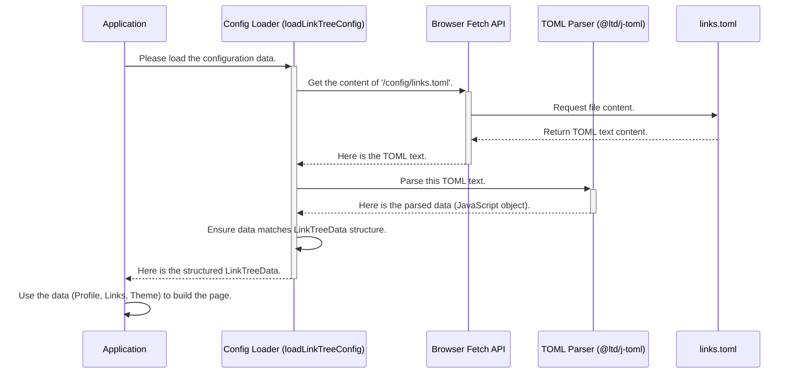

# Chapter 1: Configuration & Data Model

Welcome to the `linktree-v2` tutorial! We're excited to guide you through building your own Linktree-style page.

Let's start with a fundamental question: How does our Linktree page know *what* information to display? Your name, your profile picture, the list of links, even the background image – where does all this come from?

This chapter explores how we define the *structure* of this information (the **Data Model**) and how we load the *actual* information from a settings file (the **Configuration**).

Think of it like baking a cake:

1.  **The Recipe (Data Model):** This tells you exactly *what* ingredients you need (flour, sugar, eggs) and in what structure. It doesn't give you the ingredients themselves, just the list and instructions.
2.  **The Shopping List & Groceries (Configuration File):** This is where you write down the specific ingredients you bought (e.g., "King Arthur Flour", "Organic Brown Sugar", "Free-Range Eggs") based on the recipe's requirements. This is your actual data.
3.  **Going Shopping & Following the Recipe (Configuration Loader):** This is the process of taking your shopping list, going to the store (reading the file), getting the groceries (parsing the data), and organizing them according to the recipe so you can start baking (making the data available to the app).

Our goal is to have a clean, easy way to manage all the text, links, and settings for our Linktree page without digging deep into the main application code every time we want to change something.

## Key Concepts

Let's break down the "Recipe" and "Shopping" parts.

### 1. The Data Model (Our Recipe) - `src/types/index.ts`

In programming, especially with TypeScript (which this project uses), we define the "shape" or "structure" of our data using **types** or **interfaces**. This is our data model. It acts like a contract or blueprint, ensuring the data we use has the expected fields and format.

For our Linktree, we need to define the structure for:

*   **Profile:** Your name, avatar (profile picture), description, and a short tagline.
*   **Links:** Each link needs a title (what the button says), a URL (where it goes), and maybe an icon.
*   **Theme:** Settings for customizing the look, like whether to use a background image.

We define these structures in the `src/types/index.ts` file. Think of this file as our master recipe book.

```typescript
// src/types/index.ts (Simplified Snippet)

// Blueprint for profile information
export interface Profile {
  name: string;
  avatar: string;
  description: string;
  tagline: string;
}

// Blueprint for a single link
export interface Link {
  title: string;
  url: string;
  icon: string; // Icon identifier (we'll see how this is used later)
}

// Blueprint for theme settings
export interface ThemeConfig {
  useBackgroundImage: boolean;
  backgroundImage?: string; // Optional: path to image
  // ... other theme settings
}

// The master blueprint combining all parts
export interface LinkTreeData {
  profile: Profile; // Must have one profile section
  links: Link[];   // Must have a list (array) of links
  theme?: ThemeConfig; // Theme settings are optional
}
```

*   **`export interface ...`**: This declares a new data structure blueprint.
*   **`name: string;`**: This means there must be a `name` field, and its value must be text (a string).
*   **`Link[]`**: The `[]` means it expects a list (an array) of `Link` items.
*   **`?` (e.g., `theme?`)**: The question mark means this part is optional.

This file doesn't contain *your* specific name or links, just the rules for how that information *should* be structured.

### 2. The Configuration File (Our Shopping List) - `public/config/links.toml`

Now that we have the recipe (the data model), we need the actual ingredients (our data). We store this information in a configuration file located at `public/config/links.toml`.

We use the **TOML** format (`.toml`) because it's designed to be easy for humans to read and write. It uses simple `key = value` pairs and sections like `[profile]` to organize data.

Here's a small example of what `links.toml` might look like:

```toml
# public/config/links.toml (Example Snippet)

[profile]
name = "Your Name"
avatar = "/images/avatar.png" # Path to your profile picture
description = "Welcome to my links page!"
tagline = "Developer | Blogger | Cat Enthusiast"

# Theme settings (optional section)
[theme]
useBackgroundImage = true
backgroundImage = "/backgrounds/background.jpg"

# Links use [[links]] - the double brackets mean it's a list!
[[links]]
title = "My Website"
url = "https://example.com"
icon = "website" # Simple identifier for an icon

[[links]]
title = "GitHub"
url = "https://github.com/yourusername"
icon = "github"

[[links]]
title = "LinkedIn"
url = "https://linkedin.com/in/yourusername"
icon = "linkedin"
```

See how this file provides the *actual* values (`"Your Name"`, `"https://example.com"`) following the structure we defined in `src/types/index.ts`?

*   `[profile]` corresponds to the `Profile` interface.
*   `[[links]]` corresponds to an item in the `Link[]` array. We have multiple `[[links]]` blocks, creating a list of links.
*   `[theme]` corresponds to the optional `ThemeConfig` interface.

Changing your name or adding a link is as simple as editing this text file!

### 3. The Configuration Loader (Going Shopping) - `src/lib/config.ts`

We have the recipe (`types/index.ts`) and the filled shopping list (`links.toml`). Now we need the code that actually reads the list and prepares the ingredients for our application. This is the job of the Configuration Loader, located in `src/lib/config.ts`.

This small piece of code does the following:

1.  **Fetches** the content of the `/config/links.toml` file.
2.  **Parses** the TOML text using a special library (`@ltd/j-toml`) to understand its structure.
3.  **Formats** the parsed data to match our `LinkTreeData` type (our recipe).
4.  **Returns** this structured data so the rest of the application can use it.

```typescript
// src/lib/config.ts (Simplified Snippet)
import { parse } from '@ltd/j-toml'; // The TOML parsing library
import { LinkTreeData } from '@/types'; // Our data model (recipe)

// Function to load and parse the config
export async function loadLinkTreeConfig(): Promise<LinkTreeData> {
  try {
    // 1. Fetch the file content from the public folder
    const response = await fetch('/config/links.toml');
    // 2. Read the file content as text
    const tomlText = await response.text();
    // 3. Parse the TOML text into a JavaScript object
    const parsedData = parse(tomlText);
    // 4. Tell TypeScript this data matches our LinkTreeData structure
    return parsedData as unknown as LinkTreeData;
  } catch (error) {
    // If anything goes wrong (file not found, bad format)
    console.error('Failed to load config:', error);
    // Return some default data so the app doesn't crash
    return { /* ... default error profile and empty links ... */ };
  }
}
```

This function, `loadLinkTreeConfig`, acts as our "shopper". When the application needs the Linktree data, it calls this function.

## How It All Works Together

Let's visualize the process when the application starts and needs to display your links:



1.  The **Application** needs the data.
2.  It calls the **Config Loader** (`loadLinkTreeConfig`).
3.  The Loader uses the browser's **Fetch API** to request the `links.toml` file.
4.  The browser retrieves the **links.toml** file content.
5.  The Loader receives the raw text.
6.  The Loader gives the text to the **TOML Parser**.
7.  The Parser converts the TOML text into a structured JavaScript object.
8.  The Loader makes sure this object fits our `LinkTreeData` blueprint.
9.  The Loader returns the final, structured data to the **Application**.
10. The Application can now confidently use `data.profile.name`, `data.links[0].url`, etc., knowing the structure is correct.

## Looking Deeper (Code Details)

Let's revisit the key files with a bit more focus.

### `src/types/index.ts` - The Blueprint

This defines the *expected* structure. It's crucial for making our code predictable and preventing errors. If the `links.toml` file is missing a required field (like `name` in `[profile]`), this structure helps us identify the problem (though in our current setup, the parser might provide `undefined`, so careful coding in components is still needed).

```typescript
// src/types/index.ts

export interface Profile {
  name: string;       // Your display name (Required)
  avatar: string;     // Path to image file (Required)
  description: string;// A short bio (Required)
  tagline: string;    // A catchy phrase (Required)
}

export interface Link {
  title: string; // Text displayed on the link button (Required)
  url: string;   // The destination URL (Required)
  icon: string;  // Identifier for the icon (e.g., "github") (Required)
}

export interface ThemeConfig {
  useBackgroundImage: boolean; // Toggle background image (Required in theme section)
  backgroundImage?: string;     // Optional: path if useBackgroundImage is true
  backgroundOverlayOpacity?: number; // Optional: 0.0 to 1.0
  backgroundBlur?: number;      // Optional: blur amount in pixels
}

// The complete data structure expected from links.toml
export interface LinkTreeData {
  profile: Profile;        // Exactly one profile section
  links: Link[];           // A list (array) of links
  theme?: ThemeConfig;     // Optional theme settings
}
```

### `public/config/links.toml` - The Data

This is where you, the user, customize your page content. Remember the format:

*   Sections like `[profile]` or `[theme]`.
*   Key-value pairs like `name = "Your Name"`.
*   Lists using `[[links]]` for each item in the list.

```toml
# public/config/links.toml

# Profile Section (Matches `Profile` interface)
[profile]
name = "Alex Doe"
avatar = "/images/profile_pic.jpg" # Make sure this image exists in /public/images
description = "Exploring the web, one link at a time."
tagline = "Code | Coffee | Content"

# Theme Section (Matches `ThemeConfig` interface)
# See public/backgrounds/README.md for more on backgrounds!
[theme]
useBackgroundImage = true
backgroundImage = "/backgrounds/background.jpg"
backgroundOverlayOpacity = 0.1 # Slightly visible overlay
backgroundBlur = 5           # Moderate blur

# Link List Section (Each [[links]] matches `Link` interface)
[[links]]
title = "Personal Blog"
url = "https://myblog.example.com"
icon = "blog" # We'll map this to an actual icon later

[[links]]
title = "Project Showcase"
url = "https://github.com/alexdoe/projects"
icon = "github"

[[links]]
title = "Connect on Twitter"
url = "https://twitter.com/alexdoe"
icon = "twitter"
```

### `src/lib/config.ts` - The Loader

This script bridges the gap between the text file (`links.toml`) and the structured data object (`LinkTreeData`) our application needs.

```typescript
// src/lib/config.ts
import { parse } from '@ltd/j-toml'; // Library to understand TOML
import { LinkTreeData } from '@/types'; // Our data blueprint

export async function loadLinkTreeConfig(): Promise<LinkTreeData> {
  try {
    // Fetch the configuration file from the public directory
    const response = await fetch('/config/links.toml');

    // Handle cases where the file might not be found
    if (!response.ok) {
      throw new Error(`HTTP error! status: ${response.status}`);
    }

    // Read the file's content as plain text
    const tomlText = await response.text();

    // Use the j-toml library to parse the text into a JS object
    // The { joiner: '\n' } helps handle multi-line strings if needed
    const parsedData = parse(tomlText, { joiner: '\n' });

    // Return the parsed data, telling TypeScript it fits our LinkTreeData shape
    // 'as unknown as LinkTreeData' is a way to assert the type
    return parsedData as unknown as LinkTreeData;

  } catch (error) {
    // If fetching or parsing fails, log the error
    console.error('Failed to load link tree configuration:', error);

    // Provide a fallback default configuration to avoid crashing the app
    return {
      profile: {
        name: 'Error Loading',
        avatar: '/vite.svg', // Default placeholder image
        description: 'Could not load configuration.',
        tagline: 'Check public/config/links.toml',
      },
      links: [], // No links to display on error
      // Theme settings will be default if not loaded
    };
  }
}
```

## Conclusion

Congratulations! You've learned about the crucial foundation of our `linktree-v2` project:

*   **Data Model (`types/index.ts`):** The blueprint defining *what* information we need and its structure (our recipe).
*   **Configuration File (`public/config/links.toml`):** The easy-to-edit file where the *actual* data lives (our shopping list).
*   **Configuration Loader (`lib/config.ts`):** The code that reads the configuration file and prepares the data for the application according to the data model (our shopper).

This separation makes it simple to update your Linktree's content without touching the application's core logic. You just edit the `links.toml` file!

Now that we understand how the application gets its data, we need a place to display it. In the next chapter, we'll build the basic structure or "shell" of our web page.

Next up: [Chapter 2: Application Shell](02_application_shell.md)

---

Generated by [AI Codebase Knowledge Builder](https://github.com/The-Pocket/Tutorial-Codebase-Knowledge)