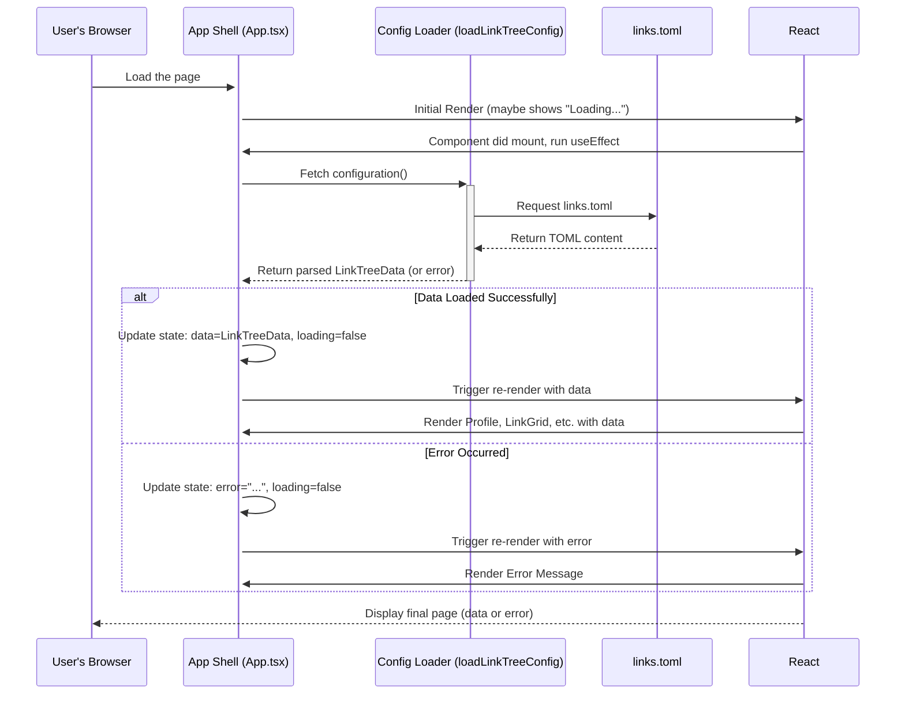

# Chapter 2: Application Shell

Welcome back! In [Chapter 1: Configuration & Data Model](01_configuration___data_model.md), we learned how our application defines the structure of our Linktree data (the recipe) and how it loads our specific information (like your name and links) from the `links.toml` file (the shopping list).

But knowing *what* data to show isn't enough. We need something to actually *put* that data onto the web page, arrange it nicely, and handle things like loading delays or errors. That's where the **Application Shell** comes in!

## What's the Big Idea? Meet the Stage Manager

Imagine putting on a play. You have actors (your profile info, your links), props (buttons, icons), and scenery (the background). But who makes sure everyone and everything is in the right place at the right time? Who handles opening the curtains when the play is ready, or telling the audience if there's a delay? That's the **Stage Manager**.

In our `linktree-v2` project, the **Application Shell** is like this Stage Manager. It's the main component, typically found in `src/App.tsx`, that orchestrates the entire page.

**Its main jobs are:**

1.  **Getting the Data:** It calls the `loadLinkTreeConfig` function we learned about in Chapter 1 to fetch your profile and link information.
2.  **Managing States:** It knows whether the data is still loading, if an error occurred while fetching, or if the data is ready to be shown.
3.  **Arranging the Components:** Once the data is ready, it puts the different visual pieces – the [Profile Component](04_profile_component.md), the [Link Grid Component](05_link_grid_component.md), the theme toggle button, and the footer – in their correct spots on the page.
4.  **Setting the Scene:** It coordinates with the [Theming System](03_theming_system.md) to apply the correct background (color or image) based on your `links.toml` settings.

Without the Application Shell, our data and visual components would just be separate pieces floating around with no structure or coordination. The Shell brings them all together into a working application.

## Key Concepts

Let's break down how the Application Shell (`src/App.tsx`) performs its duties.

### 1. Fetching the Data (Calling the Shopper)

The first thing the Shell needs is the data from `links.toml`. It uses a special mechanism in React called the `useEffect` hook to run the data-fetching process *after* the initial component is rendered.

```typescript
// src/App.tsx (Simplified Snippet)
import { useEffect, useState } from 'react';
import { LinkTreeData } from './types';
import { loadLinkTreeConfig } from './lib/config'; // Our data loader from Ch 1

function App() {
  const [data, setData] = useState<LinkTreeData | null>(null);
  // ... other state variables for loading/error

  // This runs once when the component first loads
  useEffect(() => {
    async function fetchData() {
      // Call the function from Chapter 1
      const config = await loadLinkTreeConfig();
      // Store the loaded data
      setData(config);
      // ... update loading/error states
    }

    fetchData(); // Execute the fetch
  }, []); // The empty array [] means "run only once"

  // ... rest of the component
}
```

*   **`useState`**: This React feature lets our component remember information, like the loaded `data`. We start with `null` (no data yet).
*   **`useEffect`**: This tells React to perform an action (like fetching data) after the component appears on screen.
*   **`loadLinkTreeConfig()`**: This is the function we explored in Chapter 1. It fetches and parses `links.toml`.
*   **`setData(config)`**: Once the data is loaded, we store it using `setData`.

### 2. Handling Different Scenarios (Loading, Error, Success)

Fetching data takes time. What should the user see while waiting? What if the `links.toml` file is missing or corrupted? The Application Shell manages these states.

We use `useState` again to keep track of whether we are `loading` or if an `error` occurred.

```typescript
// src/App.tsx (Simplified Snippet)
function App() {
  const [data, setData] = useState<LinkTreeData | null>(null);
  const [loading, setLoading] = useState(true); // Start in loading state
  const [error, setError] = useState<string | null>(null); // Start with no error

  useEffect(() => {
    async function fetchData() {
      try {
        setLoading(true); // We are now loading
        setError(null); // Reset any previous error
        const config = await loadLinkTreeConfig();
        setData(config);
      } catch (err) {
        setError('Oops! Could not load the links.'); // Set error message
        console.error(err);
      } finally {
        setLoading(false); // Done loading (whether success or error)
      }
    }
    fetchData();
  }, []);

  // ... rendering logic based on state ...
}
```

*   We add `loading` (starts `true`) and `error` (starts `null`) states.
*   Inside `fetchData`, we update these states: set `loading` to `true` before fetching, clear `error`, set `error` if fetching fails, and always set `loading` to `false` in the `finally` block (which runs after `try` or `catch`).

Now, in the part of the code that decides what to show (the return statement), we can check these states:

```typescript
// src/App.tsx (Simplified Rendering Logic)

  if (loading) {
    return <p>Loading your awesome links...</p>; // Show loading message
  }

  if (error) {
    return <p>Error: {error}</p>; // Show error message
  }

  if (data) {
    // Data loaded successfully! Show the main content:
    return (
      <div>
        {/* We'll add Profile, Links, etc. here */}
        <p>Welcome, {data.profile.name}!</p>
      </div>
    );
  }

  // Should not happen if logic is correct, but good fallback
  return <p>Something went wrong.</p>;
```

This is called **conditional rendering**. We show different things based on the current state (`loading`, `error`, or `data` is available).

### 3. Arranging the Pieces (Component Composition)

Once the data is successfully loaded (`data` is not `null`), the Shell renders the actual visual components, passing the relevant data down to them.

```typescript
// src/App.tsx (Simplified - Showing Component Arrangement)
import { Profile } from './components/profile'; // Import Profile component
import { LinkGrid } from './components/link-grid'; // Import LinkGrid component
import { Footer } from './components/footer';
import { ThemeToggle } from './components/theme-toggle';

// ... (useState, useEffect for data fetching as above) ...

function App() {
  // ... state variables (data, loading, error) ...
  // ... useEffect for fetching ...

  if (loading) { /* ... show loading ... */ }
  if (error) { /* ... show error ... */ }

  // Data is loaded successfully!
  return (
    <div className="main-container"> {/* Basic layout div */}
      {/* Theme Toggle usually fixed somewhere */}
      <div className="theme-toggle-area">
        <ThemeToggle />
      </div>

      <main className="content-area">
        {/* Pass profile data to the Profile component */}
        {data && <Profile profile={data.profile} />}

        {/* Pass link data to the LinkGrid component */}
        {data && <LinkGrid links={data.links} />}
      </main>

      {/* Pass profile name to Footer */}
      <Footer name={data?.profile?.name} />
    </div>
  );
}
```

*   We `import` the components we need (like `Profile`, `LinkGrid`).
*   Inside the successful data state (`if (data)` block, implicitly shown here in the `return`), we render these components.
*   Crucially, we pass the relevant parts of the loaded `data` as **props** (properties) to each component.
    *   `<Profile profile={data.profile} />` gives the profile information to the `Profile` component.
    *   `<LinkGrid links={data.links} />` gives the list of links to the `LinkGrid` component.
*   This way, each component only needs to know about the specific data it needs to display, keeping things organized. The Shell acts as the central distributor.

### 4. Setting the Scene (Dynamic Background)

The Shell also handles the dynamic background based on the `theme` settings in your `links.toml`. It uses a helper component (`ThemeBackground`) for this.

```typescript
// src/App.tsx (Simplified - Adding Background)
import { ThemeBackground } from './components/theme-background'; // Helper for background

function App() {
  // ... state variables (data, loading, error) ...
  // ... useEffect for fetching ...

  if (loading) { /* ... */ }
  if (error) { /* ... */ }

  return (
    <div className="main-container">
      {/* Render background based on theme data (if available) */}
      {data?.theme && <ThemeBackground theme={data.theme} />}

      {/* Theme Toggle */}
      {/* ... */}
      <main className="content-area">
        {/* Profile */}
        {/* LinkGrid */}
        {/* ... */}
      </main>
      {/* Footer */}
      {/* ... */}
    </div>
  );
}
```

*   We add a `ThemeBackground` component.
*   We only render it if `data.theme` exists in our configuration.
*   We pass the `data.theme` object to it, so it knows whether to use a background image, what image to use, opacity, blur, etc. We'll explore how this works more in [Chapter 3: Theming System](03_theming_system.md).

## How it Works Under the Hood

Let's visualize the flow when you load the page:



1.  **Browser loads:** Your browser starts loading the app.
2.  **Initial Render:** React renders the `App` shell, which initially likely shows a "Loading..." message because `loading` is `true`.
3.  **`useEffect` Runs:** After the first render, the `useEffect` hook fires.
4.  **Fetch Data:** The shell calls `loadLinkTreeConfig`.
5.  **Load & Parse:** The loader fetches and parses `links.toml`.
6.  **Data Returned:** The loader returns the structured data (or an error).
7.  **State Update:** The shell updates its internal state (`data`, `loading`, `error`) based on the result.
8.  **Re-render:** React detects the state change and re-renders the `App` shell.
9.  **Display Content:** This time, based on the updated state, React renders either the main content (Profile, Links) or an error message.

### Code Connections

*   **`src/main.tsx`:** This is the ultimate entry point. It tells React to render our `<App />` component into the HTML page. It also wraps `<App />` in a `ThemeProvider`, which we'll discuss in [Chapter 3: Theming System](03_theming_system.md).

    ```typescript
    // src/main.tsx (Simplified)
    import { createRoot } from 'react-dom/client';
    import App from './App.tsx';
    import { ThemeProvider } from './components/theme-provider.tsx';
    import './index.css'; // Main styles

    createRoot(document.getElementById('root')!).render(
      // ThemeProvider sets up light/dark mode switching
      <ThemeProvider defaultTheme="system" storageKey="linktree-theme">
        <App /> {/* Our Application Shell is rendered here! */}
      </ThemeProvider>
    );
    ```

*   **`src/App.tsx`:** This is the core file for the Application Shell, containing the logic we've discussed: state management (`useState`), data fetching (`useEffect`), conditional rendering (`if/else` or ternary operators), and arranging child components (`<Profile>`, `<LinkGrid>`, etc.).

## Conclusion

You've now learned about the **Application Shell** (`App.tsx`), the central coordinator of our `linktree-v2` application. It's the "Stage Manager" that:

*   Initiates data fetching using the loader from Chapter 1.
*   Manages loading and error states gracefully.
*   Arranges all the visual components ([Profile Component](04_profile_component.md), [Link Grid Component](05_link_grid_component.md), etc.) on the page.
*   Applies the background based on theme settings.

Understanding the Shell is key because it's the backbone that holds the entire user interface together.

With the data loaded and the basic structure in place, let's dive deeper into how we make the page look good and adapt to user preferences.

Next up: [Chapter 3: Theming System](03_theming_system.md)

---

Generated by [AI Codebase Knowledge Builder](https://github.com/The-Pocket/Tutorial-Codebase-Knowledge)