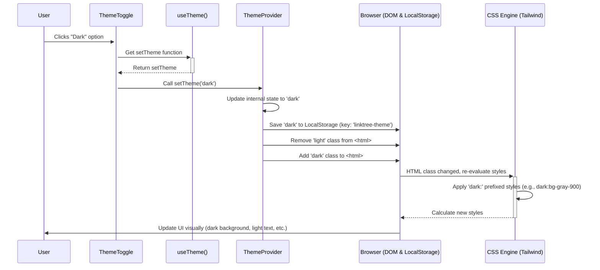

# Chapter 3: Theming System

Welcome back! In [Chapter 2: Application Shell](02_application_shell.md), we built the main stage for our application, the `App.tsx` component, which loads data and arranges the different parts of our page. Now, let's talk about making it look good and allowing users to choose how they want it to look!

## What's the Big Idea? Light Switch for Your App!

Have you ever used an app that lets you switch between a "Light Mode" (bright background, dark text) and a "Dark Mode" (dark background, light text)? Or maybe it automatically matches your computer's settings? That's exactly what our **Theming System** does for `linktree-v2`.

Think of your room's lighting:

*   You might have bright daylight settings.
*   You might have cozy evening settings.
*   You have a light switch on the wall to change between them.
*   There's a central control panel (maybe in your fuse box) that manages the power and remembers your preferred setting.

Our Theming System works similarly:

1.  **Provides Themes:** Defines "light" and "dark" visual styles (colors, backgrounds).
2.  **User Control:** Gives the user a button (`ThemeToggle`) to switch between light, dark, or match their system preference.
3.  **Applies Themes:** Makes sure the *entire* application (buttons, text, background) changes appearance instantly when the theme changes.
4.  **Remembers Preference:** Saves the user's choice in their browser so it stays the same even if they close and reopen the page.

The goal is to offer visual comfort and personalization, making the application adapt to different user preferences and environments.

## Key Concepts

Let's meet the main actors in our theming play:

### 1. The `ThemeProvider` (The Control Panel) - `src/components/theme-provider.tsx`

This is the invisible brain behind the operation. It's a special component that wraps around our entire application (we saw it in `src/main.tsx` in the previous chapter).

*   **Holds the Current Theme:** It keeps track of whether the app should be 'light', 'dark', or 'system'.
*   **Listens for Changes:** It provides a way for other components (like the toggle button) to tell it to change the theme.
*   **Applies the Theme Globally:** When the theme changes, it updates the main HTML structure of the page (specifically, it adds a class like `light` or `dark` to the `<html>` tag). This is the signal for all the CSS styles to adapt.
*   **Saves the Setting:** It automatically saves the user's chosen theme (light, dark, or system) to the browser's **local storage** (a small storage space websites can use). When you revisit the page, it reads this saved setting to apply your preferred theme.

```typescript
// src/main.tsx (Where ThemeProvider is used)
import { createRoot } from 'react-dom/client';
import App from './App.tsx';
import { ThemeProvider } from './components/theme-provider.tsx'; // Import it
import './index.css';

createRoot(document.getElementById('root')!).render(
  // ThemeProvider wraps the entire App!
  <ThemeProvider defaultTheme="system" storageKey="linktree-theme">
    <App />
  </ThemeProvider>
);
```

*   Think of `<ThemeProvider>` as setting up the main lighting control system for the entire house (`<App />`).
*   `defaultTheme="system"`: If no preference is saved, it defaults to matching the user's operating system setting.
*   `storageKey="linktree-theme"`: This is the name used to save the preference in the browser's local storage.

### 2. The `useTheme` Hook (Asking the Control Panel) - `src/components/theme-provider.tsx`

How does a component, like the toggle button, interact with the `ThemeProvider`? It uses a special function called `useTheme`.

*   **Gets Current Theme:** A component can call `useTheme()` to find out what the current theme is ('light', 'dark', or 'system').
*   **Provides `setTheme` Function:** It also gets a function (usually called `setTheme`) that allows the component to request a theme change. Calling `setTheme('dark')` tells the `ThemeProvider` to switch to dark mode.

It's like having a remote control connected to the main lighting panel.

### 3. The `ThemeToggle` Component (The Light Switch Button) - `src/components/theme-toggle.tsx`

This is the actual button the user sees and clicks. It's usually placed somewhere convenient, like the top corner of the page (as seen in `src/App.tsx`).

```typescript
// src/App.tsx (Where ThemeToggle is placed)
import { ThemeToggle } from './components/theme-toggle'; // Import it
// ... other imports

function App() {
  // ... state for data, loading, error ...
  // ... useEffect for fetching ...

  return (
    <div /* ... main layout ... */ >
      {/* Theme toggle button fixed in the corner */}
      <div className="fixed top-4 right-4 z-10">
        <ThemeToggle />
      </div>

      {/* ... rest of the app content (Profile, LinkGrid, etc.) ... */}
    </div>
  );
}
```

The `ThemeToggle` component itself uses the `useTheme` hook:

1.  It calls `useTheme()` to get the `setTheme` function.
2.  When the user clicks the button (or selects an option from its dropdown), it calls `setTheme('light')`, `setTheme('dark')`, or `setTheme('system')` to tell the `ThemeProvider` to make the change.
3.  It often shows different icons (like a sun or moon) depending on the current theme.

```typescript
// src/components/theme-toggle.tsx (Simplified Logic)
import { Moon, Sun } from "lucide-react"; // Icons
import { Button } from "@/components/ui/button"; // Basic button style
import { useTheme } from "@/components/theme-provider"; // Get the hook

export function ThemeToggle() {
  // Get the function to change the theme
  const { setTheme } = useTheme();

  // Simplified: Buttons to directly set the theme
  return (
    <div>
      <Button onClick={() => setTheme("light")}><Sun /> Light</Button>
      <Button onClick={() => setTheme("dark")}><Moon /> Dark</Button>
      <Button onClick={() => setTheme("system")}>System</Button>
    </div>
    // Note: The actual component uses a dropdown menu for a cleaner look
  );
}
```

### 4. CSS Magic (How Styles Adapt) - `src/index.css` & Tailwind CSS

How does changing a class on the `<html>` tag magically restyle everything? We use a CSS framework called **Tailwind CSS**.

Tailwind allows us to write styles that *conditionally* apply in dark mode. For example:

```css
/* Example using Tailwind classes in a component */
<div class="bg-white dark:bg-gray-900 text-black dark:text-white">
  Hello!
</div>
```

*   `bg-white`: Sets a white background *normally* (in light mode).
*   `dark:bg-gray-900`: **If** the `dark` class is present on the `<html>` tag (thanks to `ThemeProvider`), this overrides the background to dark gray.
*   `text-black`: Sets black text color normally.
*   `dark:text-white`: Sets white text color in dark mode.

The `ThemeProvider` just flips the main switch (`light` or `dark` class), and all the Tailwind styles automatically react because they are designed to look for that `dark:` prefix. Most UI components from libraries like `shadcn/ui` (which we'll touch on in [Chapter 6: UI Primitives (shadcn/ui style)](06_ui_primitives__shadcn_ui_style_.md)) are built with this dark mode support baked in.

## How It All Works Together

Let's trace the steps when you click the "Dark" option in the `ThemeToggle`:



1.  **Click:** You click the "Dark" mode option in the `ThemeToggle`.
2.  **Get Function:** The `ThemeToggle` already has the `setTheme` function obtained via `useTheme`.
3.  **Request Change:** `ThemeToggle` calls `setTheme('dark')`.
4.  **Update State:** The `ThemeProvider` receives this, updates its internal memory of the current theme to `'dark'`.
5.  **Save Preference:** `ThemeProvider` saves the string `'dark'` into the browser's local storage under the key `'linktree-theme'`.
6.  **Update DOM:** `ThemeProvider` tells the browser to update the main `<html>` tag: remove the `light` class (if present) and add the `dark` class.
7.  **CSS Reacts:** The browser's CSS engine notices the class change. It now applies all the Tailwind CSS rules that start with `dark:` (like `dark:bg-gray-900`, `dark:text-white`).
8.  **UI Updates:** The page visually changes to dark mode!

If you chose "System", the `ThemeProvider` would check your OS preference and add either `light` or `dark` accordingly.

## Looking Deeper (Code Details)

Let's peek inside the key files (simplified for clarity).

### `src/components/theme-provider.tsx` - The Control Panel Internals

```typescript
import { createContext, useContext, useEffect, useState } from "react";

type Theme = "dark" | "light" | "system";

// Define what information the context will provide
type ThemeProviderState = {
  theme: Theme;
  setTheme: (theme: Theme) => void; // Function to change theme
};

// Create the 'context' - a way to share state
const ThemeProviderContext = createContext<ThemeProviderState>({
  theme: "system", // Default value if no provider is found
  setTheme: () => console.log("No theme provider"),
});

export function ThemeProvider({ children, defaultTheme = "system", storageKey = "vite-ui-theme" }: { /* component props */ }) {
  // 1. State to hold the current theme
  const [theme, setThemeState] = useState<Theme>(
    // Read saved theme from localStorage, or use default
    () => (localStorage.getItem(storageKey) as Theme) || defaultTheme
  );

  // 2. Effect to apply theme to HTML and save changes
  useEffect(() => {
    const root = window.document.documentElement; // The <html> tag

    root.classList.remove("light", "dark"); // Clear previous theme class

    let effectiveTheme = theme;
    if (theme === "system") {
      // Check OS preference if theme is 'system'
      effectiveTheme = window.matchMedia("(prefers-color-scheme: dark)").matches
        ? "dark"
        : "light";
    }

    root.classList.add(effectiveTheme); // Add the correct class ('light' or 'dark')

  }, [theme]); // Re-run this effect whenever 'theme' state changes

  // 3. Function to update theme state and localStorage
  const handleSetTheme = (newTheme: Theme) => {
    localStorage.setItem(storageKey, newTheme); // Save to localStorage
    setThemeState(newTheme); // Update the internal state
  };

  // 4. Provide the current theme and the function to change it
  const value = {
    theme,
    setTheme: handleSetTheme,
  };

  return (
    <ThemeProviderContext.Provider value={value}>
      {children} {/* Render the rest of the app inside */}
    </ThemeProviderContext.Provider>
  );
}

// 5. The hook components use to access the theme context
export const useTheme = () => {
  const context = useContext(ThemeProviderContext);
  if (!context) throw new Error("useTheme must be used within a ThemeProvider");
  return context;
};
```

*   **`useState`**: Holds the current theme (`'light'`, `'dark'`, or `'system'`). It initializes by reading from `localStorage`.
*   **`useEffect`**: This runs whenever the `theme` state changes. It calculates the *actual* theme to apply (handling `'system'`) and adds/removes the `light`/`dark` class on the `<html>` element.
*   **`handleSetTheme`**: This function is what gets called when `setTheme(...)` is used. It saves the *chosen* theme (even if it's `'system'`) to `localStorage` and updates the component's state, triggering the `useEffect`.
*   **`ThemeProviderContext.Provider`**: This makes the `value` (containing the current `theme` and the `setTheme` function) available to all components rendered inside it (our entire `App`).
*   **`useTheme`**: This hook simply uses React's `useContext` to easily grab the `value` provided by the nearest `ThemeProviderContext.Provider`.

### `src/components/theme-toggle.tsx` - The Button Internals

```typescript
import { Moon, Sun } from "lucide-react";
import { Button } from "@/components/ui/button";
import { useTheme } from "@/components/theme-provider"; // Import the hook
// ... imports for DropdownMenu components ...

export function ThemeToggle() {
  // Use the hook to get the function for changing the theme
  const { setTheme } = useTheme();

  return (
    // The actual component uses a DropdownMenu from shadcn/ui
    // This structure allows a button with Sun/Moon icons that opens a menu
    <DropdownMenu>
      <DropdownMenuTrigger asChild>
        {/* The button that shows the Sun/Moon icon */}
        <Button variant="outline" size="icon" className="rounded-full">
          <Sun className="h-[1.2rem] w-[1.2rem] dark:hidden" /> {/* Show Sun in light mode */}
          <Moon className="hidden h-[1.2rem] w-[1.2rem] dark:block" /> {/* Show Moon in dark mode */}
          <span className="sr-only">Toggle theme</span> {/* For screen readers */}
        </Button>
      </DropdownMenuTrigger>
      <DropdownMenuContent align="end">
        {/* Menu items call setTheme when clicked */}
        <DropdownMenuItem onClick={() => setTheme("light")}>
          Light
        </DropdownMenuItem>
        <DropdownMenuItem onClick={() => setTheme("dark")}>
          Dark
        </DropdownMenuItem>
        <DropdownMenuItem onClick={() => setTheme("system")}>
          System
        </DropdownMenuItem>
      </DropdownMenuContent>
    </DropdownMenu>
  );
}
```

*   **`useTheme()`**: It gets the `setTheme` function from our `ThemeProvider`.
*   **Icons:** It uses `Sun` and `Moon` icons, cleverly using Tailwind's `dark:hidden` and `dark:block` (or similar classes in the actual code) to show only the relevant icon based on the current theme applied by the `ThemeProvider`.
*   **`onClick={() => setTheme("...")}`:** Each menu item is wired up to call the `setTheme` function with the corresponding value when clicked. This sends the message back to the `ThemeProvider` to initiate the change.

## Conclusion

You've successfully explored the `linktree-v2` Theming System! You learned about:

*   **`ThemeProvider`:** The central controller that manages the theme state, applies it globally by changing HTML classes, and saves preferences to local storage.
*   **`useTheme`:** The hook components use to access the current theme and the function (`setTheme`) to request changes.
*   **`ThemeToggle`:** The user-facing button that utilizes `useTheme` to allow switching between light, dark, and system themes.
*   **CSS (Tailwind):** How CSS styles, particularly Tailwind's `dark:` variants, automatically adapt based on the class set by the `ThemeProvider`.

This system provides a seamless way for users to personalize their viewing experience.

Now that our application can load data, has a basic structure, and can change its appearance, let's start building the specific content sections. First up: displaying your personal information.

Next up: [Chapter 4: Profile Component](04_profile_component.md)

---

Generated by [AI Codebase Knowledge Builder](https://github.com/The-Pocket/Tutorial-Codebase-Knowledge)