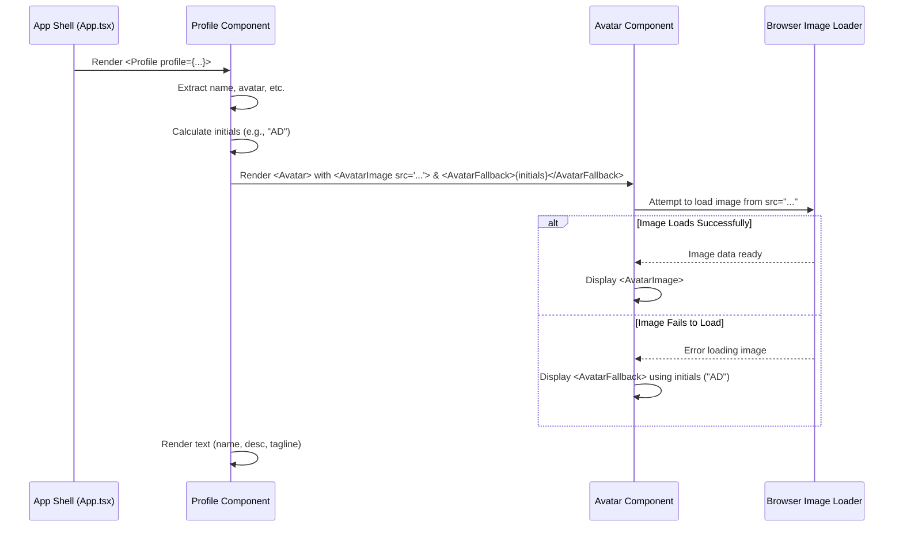

# Chapter 4: Profile Component

Welcome back! In [Chapter 3: Theming System](03_theming_system.md), we learned how to control the look and feel of our page with light and dark modes. Now, let's focus on displaying the core identity information at the very top of our Linktree page.

## What's the Big Idea? Your Digital ID Card

Think about your personal Linktree page. What's the first thing people should see? Probably your name, your face (or logo), and maybe a quick sentence about who you are. This section acts like your digital ID card or the cover of your personal book – it establishes your identity right away.

The **Profile Component** is specifically designed for this job. It takes the profile information we defined back in [Chapter 1: Configuration & Data Model](01_configuration___data_model.md) (your name, avatar image path, description, tagline) and presents it neatly at the top of the page.

**Its main tasks are:**

1.  **Receive Profile Data:** It gets the user's profile details from its parent component (the [Application Shell](02_application_shell.md)).
2.  **Display Text:** It shows the user's name, description, and tagline.
3.  **Display Avatar:** It shows the user's profile picture.
4.  **Handle Image Loading:** If the profile picture can't be found or loaded, it cleverly shows the user's initials instead, so it never looks broken.

## How Do We Use It?

Remember our [Application Shell](02_application_shell.md) (`src/App.tsx`)? It loads all the data from `links.toml`. Once it has the data, it passes the `profile` part down to the `Profile` component.

Imagine the Application Shell is the director of a movie, and the Profile Component is the actor playing the main character. The director hands the actor the script section containing *their* lines and character description (the `profile` data).

Here's how the Application Shell uses the Profile component (simplified):

```typescript
// src/App.tsx (Simplified - showing how Profile is used)
import { Profile } from './components/profile'; // Import the component
import { LinkTreeData } from './types'; // Import the data structure type
// ... other imports and state management (loading, data, error) ...

function App() {
  const [data, setData] = useState<LinkTreeData | null>(null);
  // ... useEffect to load data into the 'data' state ...

  // If data is loaded successfully:
  if (data) {
    return (
      <div className="main-container">
        {/* ... Theme Toggle, Background ... */}
        <main className="content-area">
          {/* === HERE IT IS! === */}
          {/* Pass the 'profile' part of the data to the Profile component */}
          <Profile profile={data.profile} />
          {/* ... LinkGrid component will go here later ... */}
        </main>
        {/* ... Footer ... */}
      </div>
    );
  }
  // ... handle loading and error states ...
}
```

*   We `import` the `Profile` component.
*   Inside the part of the `App` component that renders when data is successfully loaded, we use `<Profile />`.
*   We pass the profile data using a **prop** called `profile`: `profile={data.profile}`. This sends the `name`, `avatar`, `description`, and `tagline` from our loaded configuration down into the `Profile` component.

## Key Concepts: Inside the Profile Component

Let's peek inside `src/components/profile.tsx` to see how it works.

### 1. Receiving the Data (Props)

The component needs to declare that it *expects* to receive `profile` data, matching the `Profile` structure we defined in `src/types/index.ts`.

```typescript
// src/components/profile.tsx (Beginning)
import { Profile as ProfileType } from "@/types"; // Import the 'blueprint'

// Define the expected input: an object named 'profile'
// that matches the 'ProfileType' structure.
interface ProfileProps {
  profile: ProfileType;
}

// The component function receives the props object
export function Profile({ profile }: ProfileProps) {
  // Now we can access profile.name, profile.avatar, etc.
  // ... rest of the component ...
}
```

*   **`ProfileType`**: We import the `Profile` interface from our types file (renaming it slightly here to avoid naming conflict with the component name).
*   **`interface ProfileProps`**: This defines the "shape" of the input the component expects. It must have a property named `profile` which itself is an object conforming to `ProfileType`.
*   **`{ profile }: ProfileProps`**: This is JavaScript/TypeScript "destructuring". It pulls the `profile` object directly out of the props object passed into the function.

### 2. Displaying the Text Info

Once the component has the `profile` data, displaying the text is straightforward using JSX (which looks like HTML):

```typescript
// src/components/profile.tsx (Text Display)
export function Profile({ profile }: ProfileProps) {
  const { name, description, tagline } = profile; // Extract for convenience

  return (
    <div className="flex flex-col items-center text-center">
      {/* ... Avatar display will go here ... */}

      {/* Display the name as a main heading */}
      <h1 className="text-4xl font-bold mb-1">{name}</h1>

      {/* Display the description with muted text color */}
      <p className="text-muted-foreground mb-2">{description}</p>

      {/* Display the tagline */}
      <p className="max-w-lg text-sm">{tagline}</p>
    </div>
  );
}
```

*   We extract `name`, `description`, and `tagline` from the `profile` object.
*   We use standard HTML-like tags (`<h1>`, `<p>`) to render the text.
*   The `className` attributes use Tailwind CSS classes for styling (like centering text, setting font size, color, and margins). We'll touch on these UI building blocks in [Chapter 6: UI Primitives (shadcn/ui style)](06_ui_primitives__shadcn_ui_style_.md).

### 3. Displaying the Avatar (with Fallback!)

Displaying the image is a bit more clever. We use a pre-built `Avatar` component (based on `shadcn/ui`, which we'll cover in [Chapter 6: UI Primitives (shadcn/ui style)](06_ui_primitives__shadcn_ui_style_.md)). This `Avatar` component is designed to handle image loading gracefully.

```typescript
// src/components/profile.tsx (Avatar Part)
import { Avatar, AvatarImage, AvatarFallback } from "@/components/ui/avatar";

export function Profile({ profile }: ProfileProps) {
  const { name, avatar /*, description, tagline */ } = profile;

  // Create initials (explained next!)
  const initials = /* ... logic to get initials ... */;

  return (
    <div className="flex flex-col items-center text-center">
      {/* Use the Avatar component */}
      <Avatar className="h-32 w-32 border-4 border-border mb-4">
        {/* Try to load the image from the 'avatar' URL */}
        <AvatarImage src={avatar} alt={name} />

        {/* If AvatarImage fails, show this fallback */}
        <AvatarFallback className="text-2xl">{initials}</AvatarFallback>
      </Avatar>

      {/* ... Text elements (h1, p) ... */}
    </div>
  );
}
```

*   We import `Avatar`, `AvatarImage`, and `AvatarFallback`.
*   `<Avatar>`: The main container component, setting the size and shape (rounded, with a border).
*   `<AvatarImage src={avatar} />`: This attempts to load the image specified by the `avatar` path from our `profile` data. If the image loads successfully, it's displayed.
*   `<AvatarFallback>{initials}</AvatarFallback>`: This is the crucial part for robustness. If the `<AvatarImage>` fails to load (e.g., broken link, file not found), this component is displayed instead. It typically shows placeholder content – in our case, the user's initials.

### 4. Calculating Initials for Fallback

How do we get those initials? We add a little bit of JavaScript logic inside the component to calculate them from the `name`.

```typescript
// src/components/profile.tsx (Initials Calculation)
export function Profile({ profile }: ProfileProps) {
  const { name, avatar, /* ... */ } = profile;

  // Calculate initials from the name
  const initials = name // e.g., "Alex Doe"
    .split(" ") // -> ["Alex", "Doe"]
    .map((n) => n[0]) // -> ["A", "D"]
    .join("") // -> "AD"
    .toUpperCase() // -> "AD" (already uppercase, but ensures it)
    .substring(0, 2); // -> "AD" (takes max first 2 chars)

  return (
    <div /* ... */ >
      <Avatar /* ... */ >
        <AvatarImage src={avatar} alt={name} />
        <AvatarFallback className="text-2xl">{initials}</AvatarFallback>
      </Avatar>
      {/* ... Text elements ... */}
    </div>
  );
}
```

This code snippet:
1.  Takes the `name`.
2.  Splits it into words by spaces.
3.  Takes the first letter (`[0]`) of each word.
4.  Joins those letters back together.
5.  Ensures they are uppercase.
6.  Takes only the first two characters (in case of long names or middle names).

This `initials` string is then used inside the `<AvatarFallback>`.

## How It Works Under the Hood

Let's visualize the process when the Profile component needs to display your info, especially the avatar:



1.  **App Shell Renders Profile:** The [Application Shell](02_application_shell.md) passes the `profile` data down.
2.  **Profile Extracts & Calculates:** The `Profile` component receives the data, extracts the needed fields (`name`, `avatar`, etc.), and calculates the `initials`.
3.  **Profile Renders Avatar:** It renders the `Avatar` component, providing both the `src` for the `AvatarImage` and the calculated `initials` for the `AvatarFallback`.
4.  **Avatar Tries Image:** The underlying `Avatar` component logic (from `shadcn/ui`, see [Chapter 6: UI Primitives (shadcn/ui style)](06_ui_primitives__shadcn_ui_style_.md)) tells the browser to try loading the image URL provided in `src`.
5.  **Success or Failure:**
    *   If the browser loads the image, the `Avatar` component shows the `AvatarImage`.
    *   If the browser *fails* (404 Not Found, network error, etc.), the `Avatar` component hides the (broken) `AvatarImage` and shows the `AvatarFallback` instead, displaying the initials.
6.  **Profile Renders Text:** Separately, the component renders the `<h1>` and `<p>` tags for the name, description, and tagline.

### Code Dive: `src/components/profile.tsx`

Let's look at the complete (but still simplified) component file:

```typescript
// src/components/profile.tsx

import { Profile as ProfileType } from "@/types"; // Data structure blueprint
import { Avatar, AvatarFallback, AvatarImage } from "@/components/ui/avatar"; // UI primitive

// Define the expected input shape
interface ProfileProps {
  profile: ProfileType;
}

// The Profile component function
export function Profile({ profile }: ProfileProps) {
  // Destructure data for easy access
  const { name, avatar, description, tagline } = profile;

  // Calculate fallback initials
  const initials = name
    .split(" ")
    .map((n) => n[0])
    .join("")
    .toUpperCase()
    .substring(0, 2);

  // Return the JSX structure to be rendered
  return (
    <div className="flex flex-col items-center justify-center text-center">
      {/* Avatar section */}
      <Avatar className="h-32 w-32 border-4 border-border mb-4">
        <AvatarImage src={avatar} alt={name} /> {/* Try loading the image */}
        <AvatarFallback className="text-2xl">{initials}</AvatarFallback> {/* Fallback */}
      </Avatar>

      {/* Text section */}
      <h1 className="text-4xl font-bold mb-1">{name}</h1>
      <p className="text-muted-foreground mb-2">{description}</p>
      <p className="max-w-lg text-sm">{tagline}</p>
    </div>
  );
}
```

### Code Dive: `src/components/ui/avatar.tsx` (Conceptual)

The `Avatar` component itself (which we'll explore more in [Chapter 6: UI Primitives (shadcn/ui style)](06_ui_primitives__shadcn_ui_style_.md)) is built using lower-level primitives. Conceptually, it handles the logic of displaying the `AvatarImage` or `AvatarFallback`.

```typescript
// src/components/ui/avatar.tsx (Highly Simplified Concept)
import * as React from "react";
import * as AvatarPrimitive from "@radix-ui/react-avatar"; // Base library
import { cn } from "@/lib/utils"; // Utility for class names

// Main container
const Avatar = React.forwardRef< /* ... */ >(({ className, ...props }, ref) => (
  <AvatarPrimitive.Root ref={ref} className={cn(/* base styles */, className)} {...props} />
));

// Image part - Radix handles the loading/error state internally
const AvatarImage = React.forwardRef< /* ... */ >(({ className, ...props }, ref) => (
  <AvatarPrimitive.Image ref={ref} className={cn(/* styles */, className)} {...props} />
));

// Fallback part - Radix shows this if Image loading fails or is delayed
const AvatarFallback = React.forwardRef< /* ... */ >(({ className, ...props }, ref) => (
  <AvatarPrimitive.Fallback ref={ref} className={cn(/* styles */, className)} {...props} />
));

export { Avatar, AvatarImage, AvatarFallback };
```

The key takeaway is that the `Avatar` component, built using libraries like Radix UI, encapsulates the complex logic of handling image loading states, making it simple for us to use in our `Profile` component.

## Conclusion

Congratulations! You've learned about the `Profile` component, the digital ID card for your Linktree page.

*   It receives profile data (`name`, `avatar`, `description`, `tagline`) via **props**.
*   It displays the text information using simple JSX tags.
*   It uses the specialized `Avatar` component (which includes `AvatarImage` and `AvatarFallback`) to display the profile picture robustly, showing initials if the image fails to load.
*   It calculates these fallback initials from the user's name.

This component ensures that the essential identity information is always presented clearly and professionally at the top of the page.

Now that we've introduced ourselves with the Profile component, it's time to display the main event: the links!

Next up: [Chapter 5: Link Grid Component](05_link_grid_component.md)

---

Generated by [AI Codebase Knowledge Builder](https://github.com/The-Pocket/Tutorial-Codebase-Knowledge)