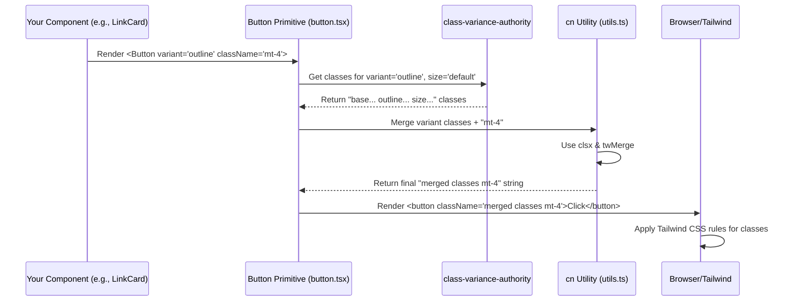

# Chapter 6: UI Primitives (shadcn/ui style)

Welcome to the final chapter! In [Chapter 5: Link Grid Component](05_link_grid_component.md), we learned how to display our list of links effectively, even using pagination for longer lists. We saw components like `LinkCard` which used a styled button inside.

But where do those basic visual elements like buttons, cards, avatars, and dropdown menus come from? How do they get their consistent look and feel throughout the application, adapting to light and dark modes?

This chapter introduces **UI Primitives**, the fundamental building blocks of our user interface, built following the `shadcn/ui` philosophy.

## What's the Big Idea? Lego Bricks for Your UI!

Imagine building something with Lego. You don't start by creating custom plastic shapes every time. You use standard bricks: 2x4s, 1x2s, wheels, windows, etc. These are your **primitives**. By combining these basic, standardized pieces in different ways, you can build complex structures like houses, cars, or spaceships.

In our `linktree-v2` project, UI Primitives are exactly like these Lego bricks. They are the fundamental, reusable components that make up our user interface:

*   `<Button>`: For clickable actions (like in `LinkCard` or `ThemeToggle`).
*   `<Card>`: A container with a border and background, often used to group content.
*   `<Avatar>`: Displays user profile pictures (like in the [Profile Component](04_profile_component.md)).
*   `<DropdownMenu>`: For menus that appear when you click something (like in `ThemeToggle`).
*   `<Separator>`: A simple dividing line.
*   `<Switch>`: An on/off toggle control.
*   ...and more!

These primitives are located in the `src/components/ui/` directory.

**Why do we need them?**

1.  **Consistency:** They ensure that all buttons look like buttons, all cards look like cards, giving the entire application a unified and professional appearance.
2.  **Reusability:** Instead of styling a button from scratch every time, we just use the `<Button>` primitive. This saves time and effort.
3.  **Maintainability:** If we want to change the default button style, we only need to modify the `src/components/ui/button.tsx` file, and the change will apply everywhere the `<Button>` is used.
4.  **Theming:** They are built with theming (light/dark mode) in mind, using Tailwind CSS classes that adapt automatically, as we saw in [Chapter 3: Theming System](03_theming_system.md).

## Key Concepts

Let's break down how these UI Primitives work.

### 1. What are UI Primitives?

They are basic, often unstyled or minimally styled, components that provide functionality and accessibility. In our case, we use primitives provided by libraries like **Radix UI** (`@radix-ui/react-*`) under the hood. Radix provides the core behavior (e.g., how a dropdown menu opens and closes, how an avatar handles image loading) without dictating the exact look.

Examples we've already seen:
*   The `Avatar`, `AvatarImage`, and `AvatarFallback` components used in the [Profile Component](04_profile_component.md) are UI primitives found in `src/components/ui/avatar.tsx`.
*   The `Button` component used in the `LinkCard` (Chapter 5) and `ThemeToggle` (Chapter 3) is a primitive from `src/components/ui/button.tsx`.
*   The `DropdownMenu` components used in the `ThemeToggle` are primitives from `src/components/ui/dropdown-menu.tsx`.

### 2. The `shadcn/ui` Approach

This project follows the philosophy of `shadcn/ui`. Unlike traditional UI libraries that you install and import from `node_modules`, `shadcn/ui` is different:

*   **You Own the Code:** You copy the code for each primitive (like `button.tsx`, `card.tsx`) directly into your project (`src/components/ui/`).
*   **Full Control:** Because the code is in your project, you can modify it however you like! Need a specific change to the default button behavior or style? Just edit the file.
*   **Built on Radix UI & Tailwind CSS:** It leverages the accessibility and functionality of Radix UI primitives and uses Tailwind CSS for styling.

Think of it like getting a blueprint (from `shadcn/ui`) for a Lego brick, and then using your own Lego factory (your project) to produce and customize that brick.

### 3. Styling with Tailwind CSS

All the visual styling (colors, padding, borders, rounded corners, responsiveness, dark mode) is done using **Tailwind CSS utility classes**.

Look inside any file in `src/components/ui/`, like `button.tsx`. You'll see lots of `className="..."` attributes filled with Tailwind classes (e.g., `bg-primary`, `text-primary-foreground`, `h-9`, `px-4`, `rounded-md`, `dark:bg-dark-variant`).

```typescript
// Example from src/components/ui/button.tsx (simplified)
// Defines different style combinations
const buttonVariants = cva(
  "inline-flex items-center justify-center rounded-md ...", // Base styles
  {
    variants: {
      variant: {
        default: "bg-primary text-primary-foreground shadow-xs ...", // Default look
        outline: "border border-input bg-background shadow-xs ...", // Outline look
        // ... other variants (destructive, ghost, link, secondary)
      },
      size: {
        default: "h-9 px-4 py-2 ...", // Default size
        sm: "h-8 rounded-md px-3 ...", // Small size
        // ... other sizes (lg, icon)
      },
    },
    // ... default variant and size
  }
);
```

This uses a helper library called `class-variance-authority` (`cva`) to define different *variants* (like style `variant="outline"` or `size="sm"`) based on combinations of Tailwind classes.

### 4. The `cn` Utility (`src/lib/utils.ts`)

How do we combine the base styles, variant styles (like "outline"), and any custom styles we might want to add when *using* the component? That's where the `cn` utility function comes in.

```typescript
// src/lib/utils.ts
import { clsx, type ClassValue } from "clsx"; // Library for conditional classes
import { twMerge } from "tailwind-merge"; // Library to intelligently merge Tailwind classes

export function cn(...inputs: ClassValue[]) {
  // 1. clsx handles conditional classes (e.g., { 'active': isActive })
  // 2. twMerge resolves Tailwind conflicts (e.g., px-2 + px-4 -> px-4)
  return twMerge(clsx(inputs));
}
```

*   **`clsx`:** Lets you easily combine class names, including conditionally adding classes.
*   **`tailwind-merge` (`twMerge`):** This is the clever part for Tailwind. If you accidentally provide conflicting Tailwind classes (like `p-2` and `p-4`), `twMerge` knows which one should take precedence (`p-4` in this case) and cleans up the final class string.

**How it's used in a primitive:**

```typescript
// Inside src/components/ui/button.tsx (simplified component part)
import { cn } from "@/lib/utils"; // Import the utility

function Button({ className, variant, size, ...props }: ButtonProps) {
  return (
    <button
      // Combines:
      // 1. Base + Variant styles from buttonVariants(...)
      // 2. Any custom classes passed via the 'className' prop
      className={cn(buttonVariants({ variant, size }), className)}
      {...props}
    />
  );
}
```

When you use `<Button variant="outline" className="mt-4" />`:
1. `buttonVariants({ variant: "outline", size: "default" })` generates the Tailwind classes for the base button + the outline style + the default size.
2. `className` contains `"mt-4"`.
3. `cn(...)` merges these two sets of classes. `twMerge` ensures the final class string is clean and without conflicts (e.g., if `buttonVariants` already included `mt-2`, `twMerge` would likely let `mt-4` override it).

## How to Use UI Primitives

Using these primitives is straightforward. You import them just like any other component and pass props to configure them.

**Example 1: Using `Button` in `LinkCard`**

Remember the `LinkCard` from [Chapter 5: Link Grid Component](05_link_grid_component.md)? It displays a link as a clickable button.

```typescript
// src/components/link-card.tsx (Simplified)
import { Link as LinkType } from "@/types";
import { Button } from "@/components/ui/button"; // 1. Import the primitive
import { getIcon } from "@/lib/icons"; // Helper to get icon component

interface LinkCardProps { link: LinkType; }

export function LinkCard({ link }: LinkCardProps) {
  const IconComponent = getIcon(link.icon); // Get the icon

  return (
    <a href={link.url} target="_blank" rel="noopener noreferrer" className="w-full">
      {/* 2. Use the primitive */}
      <Button
        variant="outline" // Use the 'outline' style variant
        className="w-full justify-start h-14 text-lg" // Add custom classes (full width, left align, taller, larger text)
      >
        <IconComponent className="mr-3 size-6" /> {/* Icon inside button */}
        {link.title} {/* Text inside button */}
      </Button>
    </a>
  );
}
```
Here, we import `Button` and use it. We specify `variant="outline"` and add some custom Tailwind classes via the `className` prop to make it full-width, taller, etc. The `cn` function inside the `Button` component merges the `outline` variant styles with our custom `w-full justify-start h-14 text-lg` classes.

**Example 2: Using `Avatar` in `Profile`**

We saw this in [Chapter 4: Profile Component](04_profile_component.md).

```typescript
// src/components/profile.tsx (Simplified Avatar part)
import { Avatar, AvatarFallback, AvatarImage } from "@/components/ui/avatar"; // 1. Import primitives
import { Profile as ProfileType } from "@/types";

interface ProfileProps { profile: ProfileType; }

export function Profile({ profile }: ProfileProps) {
  const { name, avatar } = profile;
  const initials = /* ... calculate initials ... */;

  return (
    <div /* ... */ >
      {/* 2. Use the primitives */}
      <Avatar className="h-32 w-32 border-4 mb-4"> {/* Custom size, border, margin */}
        <AvatarImage src={avatar} alt={name} /> {/* Image source */}
        <AvatarFallback className="text-2xl">{initials}</AvatarFallback> {/* Fallback content + style */}
      </Avatar>
      {/* ... text elements ... */}
    </div>
  );
}

```
We import `Avatar`, `AvatarImage`, and `AvatarFallback`. We use `<Avatar>` as the container, passing custom size and border classes. `<AvatarImage>` gets the image source, and `<AvatarFallback>` gets the initials and custom text size. The underlying Radix primitives handle the logic of showing the fallback if the image fails, and `cn` within each primitive merges base styles with our custom classes.

## Internal Implementation: How a Primitive Works

Let's take the `<Button>` component as an example. What happens when you render `<Button variant="outline" className="mt-4">Click</Button>`?

1.  **Component Called:** Your code calls the `Button` function component exported from `src/components/ui/button.tsx`.
2.  **Props Received:** It receives `variant="outline"`, `className="mt-4"`, `children="Click"`, and maybe other default props.
3.  **Get Variant Classes:** It calls `buttonVariants({ variant: "outline", size: "default" })` (assuming size is default). The `cva` function looks up the right combination of Tailwind classes for the base style + outline variant + default size and returns them as a string (e.g., `"inline-flex ... border border-input bg-background ... h-9 px-4 ..."`).
4.  **Merge Classes with `cn`:** The `Button` component then calls `cn(variantClasses, className)`.
    *   `cn` receives the variant classes string and `"mt-4"`.
    *   `clsx` combines them: `"inline-flex ... border ... bg-background ... h-9 px-4 ... mt-4"`.
    *   `twMerge` checks for conflicts. In this case, there are likely no conflicts, so it returns the combined string.
5.  **Render Element:** The `Button` component renders the actual `<button>` HTML element, passing the final, merged class string to its `className` attribute, along with any other HTML attributes and the `children` ("Click").
6.  **Browser Styles:** The browser applies the CSS rules defined by Tailwind for all the classes in the final string (`inline-flex`, `items-center`, `border`, `border-input`, `bg-background`, `h-9`, `px-4`, `mt-4`, etc.).



### Code Dive: Primitives

Let's glance at the code provided earlier.

**`src/lib/utils.ts` (`cn` function):**
We already saw this - it uses `clsx` and `twMerge` to smartly combine class names.

```typescript
// src/lib/utils.ts
import { clsx, type ClassValue } from "clsx";
import { twMerge } from "tailwind-merge";

export function cn(...inputs: ClassValue[]) {
  return twMerge(clsx(inputs));
}
```
This tiny function is essential for making Tailwind styling flexible and robust within the primitives.

**`src/components/ui/button.tsx` (Simplified):**
Focus on `buttonVariants` defining styles and the component using `cn`.

```typescript
import * as React from "react";
import { cva, type VariantProps } from "class-variance-authority"; // For variants
import { cn } from "@/lib/utils"; // Our utility

// 1. Define base styles and variants using Tailwind classes
const buttonVariants = cva(
  "inline-flex items-center justify-center rounded-md ...", // Base
  {
    variants: {
      variant: {
        default: "bg-primary text-primary-foreground ...",
        outline: "border border-input bg-background ...", // Outline styles
        // ... other variants
      },
      size: { /* ... size variants ... */ },
    },
    defaultVariants: { variant: "default", size: "default" },
  }
);

// Define expected props (including variants)
interface ButtonProps extends React.ButtonHTMLAttributes<HTMLButtonElement>,
    VariantProps<typeof buttonVariants> {}

// 2. The component itself
const Button = React.forwardRef<HTMLButtonElement, ButtonProps>(
  ({ className, variant, size, ...props }, ref) => {
    return (
      <button
        // 3. Use cn to merge variant classes with custom className
        className={cn(buttonVariants({ variant, size }), className)}
        ref={ref}
        {...props} // Pass other props like onClick, children, etc.
      />
    );
  }
);
Button.displayName = "Button";

export { Button, buttonVariants };
```
This structure (defining variants with `cva`, using `cn` in the component) is common across many `shadcn/ui` primitives.

**`src/components/ui/avatar.tsx` (Simplified):**
Notice how it wraps the Radix primitive (`AvatarPrimitive`) and uses `cn`.

```typescript
import * as React from "react";
import * as AvatarPrimitive from "@radix-ui/react-avatar"; // Radix primitive
import { cn } from "@/lib/utils"; // Our utility

// 1. Wrap the Radix Root component, applying base styles via cn
const Avatar = React.forwardRef<
  React.ElementRef<typeof AvatarPrimitive.Root>,
  React.ComponentPropsWithoutRef<typeof AvatarPrimitive.Root>
>(({ className, ...props }, ref) => (
  <AvatarPrimitive.Root
    ref={ref}
    // Merge base styles with custom className
    className={cn("relative flex size-8 shrink-0 overflow-hidden rounded-full", className)}
    {...props}
  />
));
Avatar.displayName = AvatarPrimitive.Root.displayName;

// 2. Wrap the Radix Image component
const AvatarImage = React.forwardRef< /* ... */ >(({ className, ...props }, ref) => (
  <AvatarPrimitive.Image
    ref={ref}
    className={cn("aspect-square size-full", className)}
    {...props}
  />
));
// ...

// 3. Wrap the Radix Fallback component
const AvatarFallback = React.forwardRef< /* ... */ >(({ className, ...props }, ref) => (
  <AvatarPrimitive.Fallback
    ref={ref}
    className={cn("bg-muted flex size-full items-center justify-center rounded-full", className)}
    {...props}
  />
));
// ...

export { Avatar, AvatarImage, AvatarFallback };
```
Each part (`Avatar`, `AvatarImage`, `AvatarFallback`) is a thin wrapper around the corresponding Radix component, primarily adding Tailwind styles via the `cn` function.

## Conclusion

Congratulations! You've reached the end of the `linktree-v2` tutorial. In this final chapter, we explored the foundational **UI Primitives**:

*   They are the basic, reusable building blocks of our interface (like Lego bricks), such as `Button`, `Card`, `Avatar`.
*   They follow the `shadcn/ui` approach, meaning their code lives directly in our project (`src/components/ui/`) for full control and customization.
*   They are styled using **Tailwind CSS** utility classes, making them themeable (light/dark mode) and responsive.
*   They often leverage headless UI libraries like **Radix UI** for core functionality and accessibility.
*   The **`cn` utility** (`src/lib/utils.ts`) plays a crucial role in intelligently merging base styles, variant styles, and custom classes passed via props.

Throughout this tutorial, we've seen how these concepts work together:

1.  [Configuration & Data Model](01_configuration___data_model.md): Defined *what* to display using TypeScript types and loaded the actual data from `links.toml`.
2.  [Application Shell](02_application_shell.md): Orchestrated data loading, state management (loading/error), and arranged the main components.
3.  [Theming System](03_theming_system.md): Enabled light/dark/system mode switching using `ThemeProvider` and Tailwind's `dark:` variants.
4.  [Profile Component](04_profile_component.md): Displayed user identity using text and the `Avatar` primitive.
5.  [Link Grid Component](05_link_grid_component.md): Showed the list of links using `LinkCard` (which itself used the `Button` primitive) and handled pagination.
6.  **UI Primitives (shadcn/ui style):** Provided the consistent, reusable, and customizable base components (`Button`, `Avatar`, etc.) used throughout the application.

By understanding these layers, you now have a solid grasp of how `linktree-v2` is built. Feel free to explore the codebase further, experiment with the `links.toml` configuration, customize the UI primitives, or even add new features! Happy coding!

---

Generated by [AI Codebase Knowledge Builder](https://github.com/The-Pocket/Tutorial-Codebase-Knowledge)