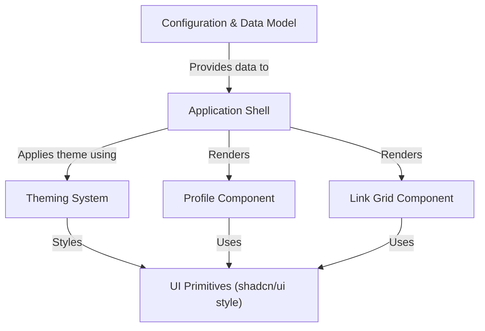

# Tutorial: linktree-v2

This project creates a simple, customizable **landing page** similar to *Linktree*.
You define your profile information (name, avatar, description) and a list of links in a configuration file (`links.toml`).
The application then displays your profile and links neatly, allowing visitors to easily navigate to your content.
It also includes a **theming system** (*light*, *dark*, *system*) with an optional dynamic background image.

**Source Repository:** [git@github.com:timhwang777/linktree-v2.git](git@github.com:timhwang777/linktree-v2.git)

## Chapters

1. [Configuration & Data Model](01_configuration___data_model.md)
2. [Application Shell](02_application_shell.md)
3. [Theming System](03_theming_system.md)
4. [Profile Component](04_profile_component.md)
5. [Link Grid Component](05_link_grid_component.md)
6. [UI Primitives (shadcn/ui style)](06_ui_primitives__shadcn_ui_style_.md)

---

Generated by [AI Codebase Knowledge Builder](https://github.com/The-Pocket/Tutorial-Codebase-Knowledge)